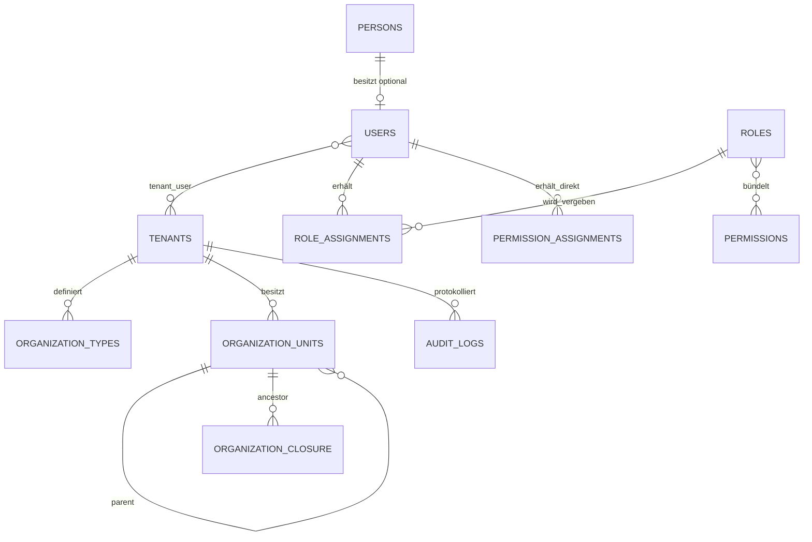

# Datenmodell – Phase 1

Alle fachlichen Tabellen der späteren Module erhalten `tenant_id`, passende zusammengesetzte Indizes und serverseitige Tenant-Prüfung. Globale Tabellen sind nur zulässig, wenn sie nachweislich keine Mandantendaten enthalten, etwa das technische Berechtigungsregister.

IDs für interne Beziehungen sind numerisch. Nach außen verwendete zentrale Datensätze erhalten zusätzlich eine nicht erratbare UUID (`public_id`). Dokumentdateien werden später mandantenbezogen außerhalb des Webroots gespeichert und ausschließlich über autorisierte Controller ausgeliefert.
